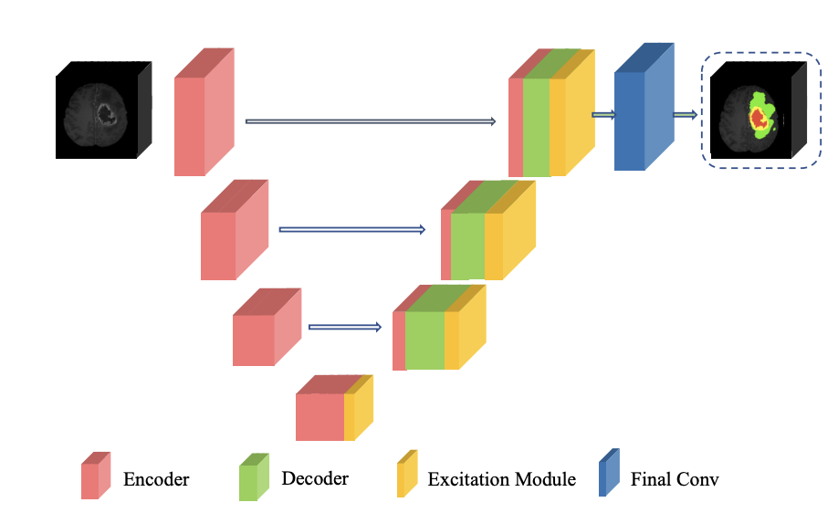

# Pytorch implementation 3D_Attention_UNet
This repository contains the official implementation of the paper "Brain Tumor Segmentation and Survival
Prediction using 3D Attention UNet" [preprint](https://arxiv.org/pdf/2104.00985.pdf) and [in workshop Proceedings](https://link.springer.com/chapter/10.1007/978-3-030-46640-4_25)<br>

The baseline implementation of UNet3D is adopted from<br>
SSD: https://github.com/wolny/pytorch-3dunet<br>
\+ https://github.com/mobarakol/3D_Attention_UNet<br>

## Dataset
[Brain Tumor Segmentation Challenge 2025 (BraTS)](https://www.synapse.org/Synapse:syn64153130/wiki/631455)<br>

## Model Architecture
The 3D Attention U-Net extends the classic U-Net encoder–decoder design with attention gates and channel excitation modules to focus on relevant regions and suppress background noise.

* Encoder (red): extracts hierarchical features from input MRI/CT volumes
* Decoder (green): reconstructs spatial details via upsampling and skip connections
* Excitation Module (yellow): enhances important feature channels using learned weights
* Final Convolution (blue): outputs voxel-wise segmentation maps for each target class


## Training

After configure config.py, you can start to train by running

`python train.py`

## Inference

After the training is completed, you can perform inference using the trained model

`python inference.py`

## Citation
If you use this code for your research, please cite our paper.

```
@inproceedings{islam2019brain,
  title={Brain tumor segmentation and survival prediction using 3D attention UNet},
  author={Islam, Mobarakol and Vibashan, VS and Jose, V Jeya Maria and Wijethilake, Navodini and Utkarsh, Uppal and Ren, Hongliang},
  booktitle={International MICCAI Brainlesion Workshop},
  pages={262--272},
  year={2019},
  organization={Springer}
}
```